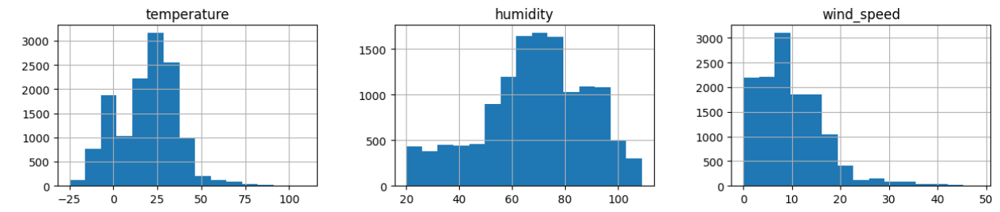

# Weather Type Classification using SVM

## Project Introduction

This project aims to predict the weather type based on various atmospheric and environmental factors. Using a dataset containing meteorological data, we build and evaluate several Support Vector Machine (SVM) classification models to determine whether the weather is **Rainy, Sunny, Cloudy, or Snowy**.

The notebook walks through a complete machine learning workflow:
1.  **Data Preparation and Exploration (EDA)**: Loading, cleaning, and visualizing the data to understand feature distributions.
2.  **Data Transformation**: Encoding categorical features and scaling numerical features to prepare the data for modeling.
3.  **Model Training**: Implementing SVM models with different kernels (Linear and RBF).
4.  **Hyperparameter Tuning**: Experimenting with different parameters to observe their effect on model performance.
5.  **Pipeline Implementation**: Using `sklearn.pipeline` to streamline the scaling and modeling process.

---

## Dataset

The dataset used is **`weather_classification_data.csv`**, sourced from Kaggle.
* **Dataset Credit:** Nikhil Narayan ([Kaggle Dataset Link](https://www.kaggle.com/datasets/nikhil7280/weather-type-classification))

### Features and Target

* **Predictor Features:**
    * `temperature`: The temperature in degrees Celsius.
    * `humidity`: The humidity percentage.
    * `wind_speed`: The wind speed in kilometers per hour.
    * `precipitation (%)`: The precipitation percentage.
    * `cloud_cover`: The cloud cover description (e.g., *partly cloudy*, *clear*).
    * `atmospheric_pressure`: The atmospheric pressure in hPa.
    * `uv_index`: The UV index.
    * `season`: The season (e.g., *Winter*, *Spring*).
    * `visibility (km)`: The visibility in kilometers.
    * `location`: The type of location (e.g., *inland*, *mountain*).

* **Target Variable:**
    * `weather_type`: The class to be predicted (Rainy, Sunny, Cloudy, Snowy).

---

## Project Workflow

### 1. Data Preparation and Exploration
The dataset was loaded and inspected. Exploratory Data Analysis (EDA) was performed to understand the data's structure and the distribution of key features:
* **Pie Chart**: Visualized the distribution of the `season` feature.
* **Histograms**: Visualized the distributions of `temperature`, `humidity`, and `wind_speed`.
* **Box Plot**: Visualized the distribution of `precipitation (%)`.



### 2. Data Transformation
To prepare the data for the SVM models, the following preprocessing steps were applied:
* **One-Hot Encoding**: Categorical features (`cloud_cover`, `location`, `season`) were converted into numerical format.
* **Feature Scaling**: All numerical features were scaled using `StandardScaler` to ensure they have a mean of 0 and a standard deviation of 1. This is crucial for SVMs, which are sensitive to the scale of input features.

### 3. Model Training and Evaluation
The preprocessed data was split into training (70%) and test (30%) sets. Three different SVM models were trained and evaluated.

---

## Results and Conclusion

The performance of the models was evaluated based on accuracy, as well as a detailed classification report (precision, recall, F1-score) and a confusion matrix.

| Model | Accuracy on Test Data |
| :--- | :--- |
| **SVM with Linear Kernel** | 88.46% |
| **SVM with RBF Kernel (Default)** | **90.56%** |
| **SVM with RBF Kernel (Custom Params)** | 89.90% |
| **Pipeline (Scaler + RBF Kernel)** | 90.40% |

### Conclusion

The **SVM model with the default RBF kernel** provided the highest accuracy (90.56%), outperforming the linear kernel. This indicates that the relationship between the weather features and the target variable is non-linear and complex. The custom-tuned model performed slightly worse than the default RBF, suggesting that the default parameters were already a good fit for this data.

The project successfully demonstrates the effectiveness of SVMs for this classification task and highlights the importance of choosing an appropriate kernel.

---

## How to Run

### Dependencies
To run the `Weather Type Classifier.ipynb` notebook, you will need the following Python libraries installed:

* pandas
* seaborn
* matplotlib
* scikit-learn

You can install them using pip:
```bash
pip install pandas seaborn matplotlib scikit-learn
